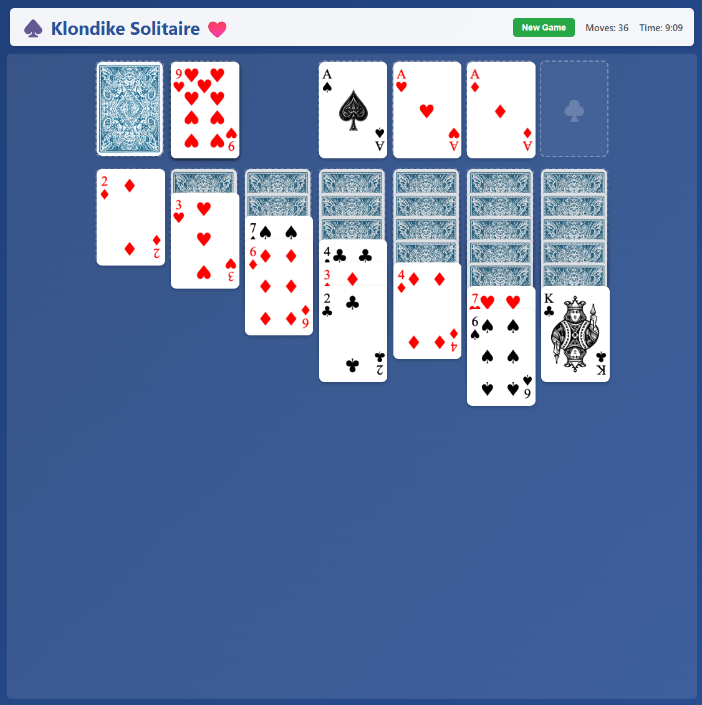

# 🃏 Klondike Solitaire
**Modern TypeScript Edition – React + Vite**

[](https://github.com/top-5/klondike/actions/workflows/deploy.yml)
[](LICENSE)

A modern, type-safe implementation of Classic Klondike Solitaire, built with React, TypeScript, and Vite, featuring beautiful spritesheet-based card graphics, custom mouse-driven drag & drop, auto-move functionality, and full move validation logic.

🎮 **[Play Now on GitHub Pages](https://top-5.github.io/klondike/)**



## ✨ Features

- ♠️ **Classic Klondike Rules** – Traditional solitaire gameplay
- 🎨 **Beautiful Card Graphics** – High-quality spritesheet rendering with subtle animations
- 🖱️ **Custom Drag & Drop** – Precise mouse-driven card movement with real-time visual feedback
- 🎯 **Multi-Card Stack Dragging** – Drag entire card sequences smoothly with proper offset
- 🚀 **Auto-Move to Foundation** – Double-click cards to automatically send them to foundations
- ✨ **Flying Animation** – Cards fly to their destination with beautiful arc motion
- ✅ **Move Validation** – Only valid moves allowed
- 🔄 **Stock Recycling** – Draw through deck multiple times
- 🏆 **Win Detection** – Automatic celebration on completion
- ⏱️ **Timer & Move Counter** – Track your performance
- 📱 **Responsive Design** – Works on desktop, tablet, and mobile
- 🔒 **Crypto RNG** – Cryptographically secure card shuffling
- 🧪 **Vitest Coverage** – Fast, comprehensive tests
- 🧩 **TypeScript 5.7+** – Strict type checking
- 💅 **ESLint + Prettier** – Consistent code style

## 🚀 Quick Start

```bash
# Install dependencies
npm install

# Start dev server (auto-opens in browser)
npm run dev

# Build production bundle
npm run build

# Preview production build
npm run preview

# Run tests
npm test
```

Open http://localhost:10010/ to play.

## 🛠️ Development

### PowerShell Helpers
```powershell
.\dev.ps1 start   # Start development mode
.\dev.ps1 stop    # Stop dev server
.\dev.ps1 status  # Check server status
```

### Build & Lint
```bash
npm run build
npm run lint
npm run format
```

### Testing
```bash
npm run test
npm run test:watch
npm run test:coverage
```

## 🧩 Technology Stack

| Layer | Technology | Purpose |
|-------|-----------|---------|
| UI | React 18 | Game interface |
| Graphics | Spritesheet | Card rendering via canvas extraction |
| Drag System | Custom Mouse Events | Precise positioning & multi-card stacks |
| Build | Vite 5 | Lightning-fast dev + build |
| Language | TypeScript 5.7 | Type-safe logic |
| Tests | Vitest 2.1 | Unit testing |
| Quality | ESLint + Prettier | Formatting and linting |
| Runtime | Node.js 18+ | ES module environment |

## 📁 Project Structure

```
cardserver/
├── index.html
├── vite.config.ts
├── vitest.config.ts
├── dev.ps1
├── src/
│   ├── main.tsx          # React entry point
│   ├── App.tsx           # Main game component
│   ├── App.css           # Styling
│   ├── types.ts          # Type definitions
│   ├── cardSprites.ts    # Spritesheet loader
│   └── gameLogic.ts      # Klondike rules engine
├── public/
│   ├── deck.png          # Card spritesheet (4x13 grid)
│   ├── back.jpg          # Card back image
│   └── screenshot.png    # Game screenshot
├── test/
│   └── *.test.ts         # Unit tests
└── .github/
    └── instructions.md
```

## 🧮 Game Rules (Classic Klondike Solitaire)

### 🎯 Objective

Move all 52 cards into four **Foundations**, building each suit from Ace to King.

### 🧱 Layout

- **Deck**: 52 standard cards (no jokers)
- **Suits**: ♠ Spades, ♥ Hearts, ♦ Diamonds, ♣ Clubs
- **Colors**: Red (♥♦) / Black (♠♣)
- **Tableau**: 7 columns (1–7 cards each)
- **Stock**: Remaining 24 cards (face-down)
- **Waste**: Discard pile (face-up)
- **Foundations**: 4 piles, one per suit (build A→K)

#### Initial Deal:

| Column | Cards | Face-up | Face-down |
|--------|-------|---------|-----------|
| 1 | 1 | 1 | 0 |
| 2 | 2 | 1 | 1 |
| 3 | 3 | 1 | 2 |
| 4 | 4 | 1 | 3 |
| 5 | 5 | 1 | 4 |
| 6 | 6 | 1 | 5 |
| 7 | 7 | 1 | 6 |

### ♻️ Gameplay Rules

#### Stock → Waste

- Draw 1 card from Stock onto Waste (classic mode)
- When Stock is empty, flip the Waste back to form a new Stock (preserve order)

#### Waste → Tableau or Foundation

- Move top Waste card to Foundation if next in suit order
- Or move to Tableau if opposite color and one rank lower

#### Tableau → Tableau

- Move sequences of descending, alternating-color cards (e.g., Red 6 on Black 7)
- Uncovering a face-down card flips it face-up automatically
- Empty columns can only be filled with a King (or sequence starting with King)

#### Foundation Building

- Build by suit in ascending order (A→K)
- Only Aces can start a foundation pile

### 🧠 Win Condition

All four Foundations complete (A→K per suit). The game ends automatically with celebration animation.

## ⚙️ Configurable Parameters

| Parameter | Description | Default |
|-----------|-------------|---------|
| draw_count | Cards drawn from Stock each turn | 1 |
| max_redeals | Number of Stock recycles | ∞ |
| auto_flip | Auto-turn face-down when uncovered | true |
| auto_move | Auto-move valid cards to Foundation | optional |
| scoring | Vegas / Standard / None | none |

## 💾 TypeScript Data Model

```typescript
type Suit = 'Spades' | 'Hearts' | 'Diamonds' | 'Clubs';
type Rank = 'A' | '2' | '3' | '4' | '5' | '6' | '7' | '8' | '9' | '10' | 'J' | 'Q' | 'K';

interface Card {
  suit: Suit;
  rank: Rank;
  faceUp: boolean;
}

interface GameState {
  stock: Card[];
  waste: Card[];
  foundations: Record<Suit, Card[]>;
  tableau: Card[][];
  moves: number;
  timer: number;
}
```

## 🎨 Card Graphics Implementation

The game uses a **spritesheet-based card rendering system** for optimal performance and visual quality:

### Spritesheet Layout
- **File**: `public/deck.png` (4 rows × 13 columns)
- **Row mapping**: 0=Clubs, 1=Hearts, 2=Spades, 3=Diamonds  
- **Column mapping**: 0=A, 1=2, ..., 9=10, 10=J, 11=Q, 12=K
- **Card back**: `public/back.jpg`

### Loading Process (`cardSprites.ts`)
1. Load `deck.png` spritesheet into memory
2. Calculate frame dimensions (width/13, height/4)
3. Extract each card using canvas `drawImage()` with precise coordinates
4. Convert to data URLs for React img elements
5. Cache all 52 cards for instant rendering

This approach provides:
- ✅ High-quality card graphics with smooth edges
- ✅ Fast rendering (pre-extracted, cached data URLs)
- ✅ Single spritesheet download (better than 52 separate images)
- ✅ Subtle animations via CSS transforms

## 🖱️ Custom Drag & Drop System

The game implements a **custom mouse-driven drag system** (not HTML5 drag API) for precise control:

### Why Custom Implementation?
- HTML5 drag API forces semi-transparency on drag images (browser limitation)
- Needed pixel-perfect positioning without "jump" on drag start
- Required multi-card stack dragging with proper visual offset
- Wanted full control over cursor states and visual feedback

### How It Works
1. **Mouse Down**: Calculate offset from card's top-left to click position
2. **Mouse Move**: Track global mouse position, update drag overlay position
3. **Drag Overlay**: Fixed-position div at `mouseX - offsetX`, `mouseY - offsetY`
4. **Original Cards**: Set to `opacity: 0` during drag (fully invisible, no ghosting)
5. **Drop Detection**: Use `elementFromPoint()` to find drop zone under cursor
6. **Mouse Up**: Validate move, update game state, reset cursor

### Features
- 🎯 **Precise positioning** – Card stays under cursor at click point
- 📚 **Multi-card stacks** – Drag sequences with 25px offset per card
- 👁️ **Clean visuals** – No ghostly images or transparency issues
- 🖱️ **Cursor feedback** – grab → grabbing → normal states
- ⚡ **High performance** – No unnecessary re-renders

## 🎨 CSS Animations

```css
/* Shimmer effect on cards */
@keyframes cardShimmer {
  0%, 100% { box-shadow: 0 2px 8px rgba(0,0,0,0.15); }
  50% { box-shadow: 0 4px 16px rgba(0,0,0,0.25); }
}

/* Flying animation for auto-move */
@keyframes flyToFoundation {
  0% { transform: scale(1) translateY(0); }
  50% { transform: scale(0.9) translateY(-30px); }
  100% { transform: scale(1) translateY(0); opacity: 0; }
}
```

## 🚀 Deployment

This project uses **GitHub Actions** for automatic deployment to GitHub Pages.

### Automatic Deployment
- Every push to `main` branch triggers the deployment workflow
- The workflow builds the app and publishes to `gh-pages` branch
- Live site updates automatically at: https://top-5.github.io/klondike/

### Manual Deployment (Optional)
```bash
npm run deploy    # Build and deploy to GitHub Pages using gh-pages
```

### Workflow Status
Check the [Actions tab](https://github.com/top-5/klondike/actions) to see deployment status and history.

## 🧱 Build & Deployment

```bash
npm run build     # Compile & bundle for production
npm run preview   # Local preview of production build
```

Everything outputs into `/dist` — ready to serve via any static host (Netlify, Vercel, GitHub Pages, etc.).

## 🧪 Testing Notes

- Run tests via Vitest for cards, moves, and win detection
- Watch mode auto-reruns tests on file save
- Coverage reports generated under `/coverage`

## 📄 License

**Non-Commercial License**

This software is free for non-commercial use (personal, educational, research, **AI training**, etc).

**Commercial use requires a separate license.** Please contact [@top-5 on GitHub](https://github.com/top-5) for commercial licensing inquiries.

See [LICENSE](LICENSE) file for full terms.

© 2025 Top-5
